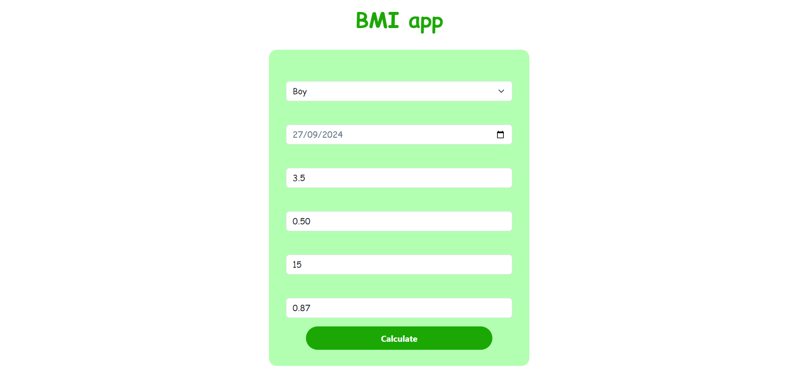
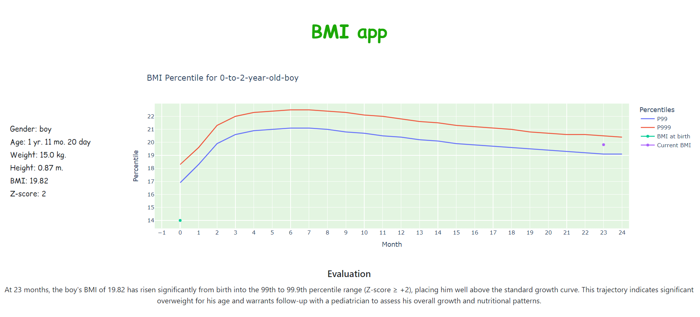

# BMI App

A web-based baby BMI calculator built with Python and Flask. The application calculates a baby's BMI based on their gender, birthdate, height, and weight, then compares the result against WHO BMI-for-age reference data.

The application also provides an interactive growth chart using Plotly and an AI-generated interpretation using the Google Gemini API.

## Demo 

Try the application using this URL: https://baby-growth-tracker-8p8f.onrender.com

### Screenshots

#### Input



#### Results



## Features

* Calculate a baby's BMI based on height and weight
* Calculate the baby's age from their birthdate
* Select the appropriate WHO reference data based on gender
* Determine the baby's BMI-for-age percentile
* Display BMI against WHO growth reference data
* Interactive BMI growth chart using Plotly
* Generate an AI-based interpretation using Google Gemini
* Use WHO z-score data to provide additional context for the AI evaluation

## Technologies Used

* **Python** — application logic and calculations
* **Flask** — web framework
* **WTForms / Flask-WTF** — form handling and validation
* **Pandas** — processing WHO reference data
* **Plotly** — interactive data visualization
* **Google Gemini API** — AI-generated interpretation
* **HTML / CSS / Bootstrap / Javascript** — frontend

## How It Works

The application follows these general steps:

1. The user enters the baby's:

   * Gender
   * Birthdate
   * Weight at birth (optional)
   * Height at birth (optional)
   * Current Weight
   * Current Height

2. The application calculates the baby's current age.

3. BMI is calculated using:

   ```text
   BMI = weight / height²
   ```

4. The application selects the appropriate WHO BMI-for-age reference data based on the baby's gender.

5. The calculated BMI is compared against the reference data to determine its corresponding percentile.

6. The BMI and WHO reference values are displayed using an interactive Plotly chart.

7. WHO z-score reference data is provided to the AI model to help generate an additional interpretation of the result.

## WHO Growth Reference Data

The application uses the World Health Organization (WHO) Child Growth Standards for BMI-for-age reference data.

Separate reference datasets are used for boys and girls.

The data includes percentile and z-score reference values across ages from birth to 24 months.

WHO Child Growth Standards:

https://www.who.int/toolkits/child-growth-standards/standards/body-mass-index-for-age-bmi-for-age

## AI Integration

The application uses the Google Gemini API to generate an additional interpretation of the baby's BMI result.

The AI receives relevant information such as:

* Gender
* Age (month)
* Calculated BMI
* WHO reference information
  * BMI-for-age percentile
  * Z-score reference data

The purpose of the AI component is to translate the numerical result and reference information into a short, understandable explanation.

The AI-generated output is intended as an additional interpretation of the calculated data and not as a medical diagnosis.

## Installation

### 1. Clone the repository

```bash
git clone https://github.com/Jerico2327/Baby_Growth_Tracker.git
cd Baby_Growth_Tracker
```

### 2. Create a virtual environment

```bash
python -m venv .venv
```

### 3. Activate the virtual environment

**Windows:**

```bash
.venv\Scripts\activate
```

**macOS / Linux:**

```bash
source .venv/bin/activate
```

### 4. Install dependencies

```bash
python -m pip install -r requirements.txt
```

## Environment Variables

The application requires a Google Gemini API key for the AI functionality.

Create a `.env` file in the project root:

```env
GEMINI_API_KEY=your_gemini_api_key
FLASK_KEY=your_flask_api_key
```

Make sure `.env` is included in `.gitignore` so that your API key is not committed to GitHub.

## Running the Application

Start the Flask application:

```bash
python main.py
```

Then open the local URL provided by Flask in your browser.

For example:

```text
http://127.0.0.1:5000
```

## Project Structure

```text
BMI-App/
│
├── main.py
├── bmi.py
│
├── templates/
│   ├── index.html
│   └── result.html
│   └── error.html
│
├── static/
│   └── style.css
│
├── data/
│   └── bmi_boys_0-to-2-years_zcores.xlsx
│   └── bmi_girls_0-to-2-years_zscores.xlsx
│   └── tab_bmi_boys_p_0_2.csv
│   └── tab_bmi_girls_p_0_2.csv
│
├── screenshots/
│   ├── input.png
│   └── result.png
│
├── design.txt
├── requirements.txt
├── .gitignore
├── .env
├── Procfile 
└── README.md
```


## Future Improvements

Possible future improvements include:

* Add historical BMI tracking
* Allow users to record multiple measurements
* Display BMI changes over time
* Improve AI-generated explanations
* Add additional WHO growth measurements
* Generate PDF of the result
* Add user accounts
* Store and retrieve previous results
* Improve mobile responsiveness

## Disclaimer

This project is intended for educational and demonstration purposes.

The calculated BMI and AI-generated interpretation should not be considered a substitute for professional medical advice, diagnosis, or treatment.
